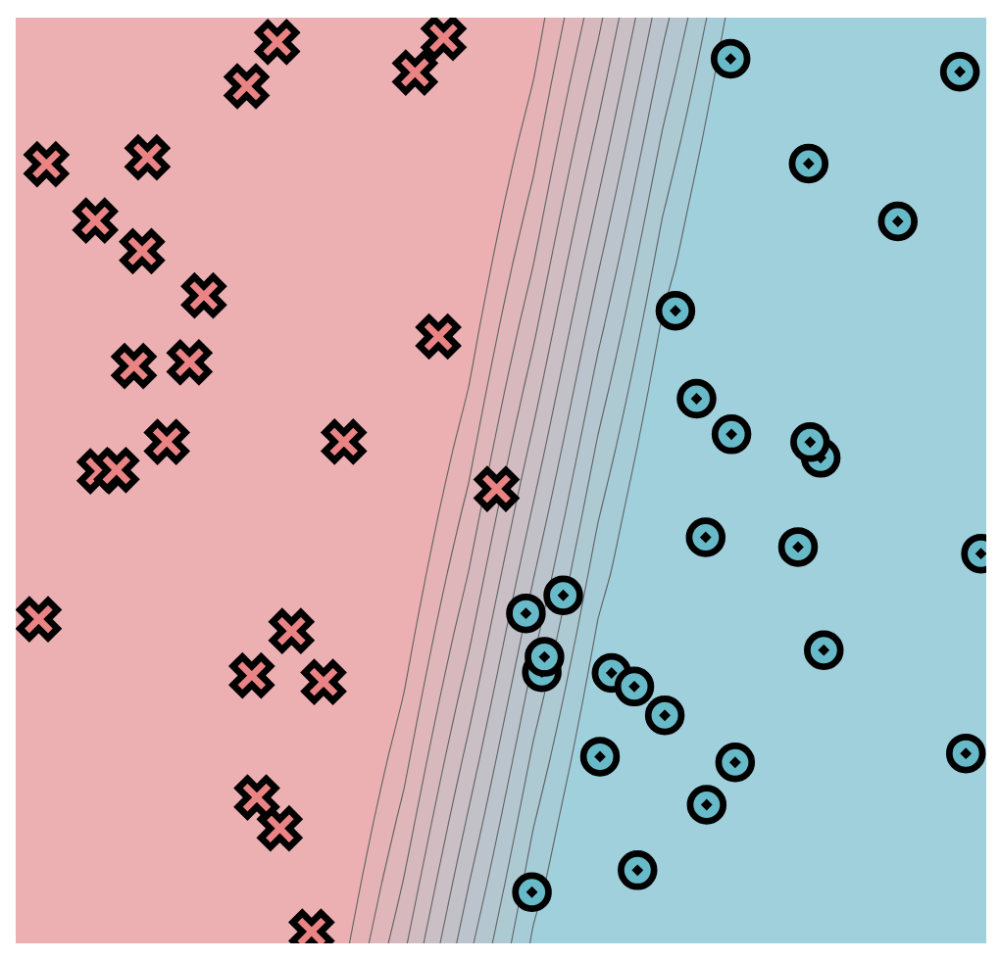
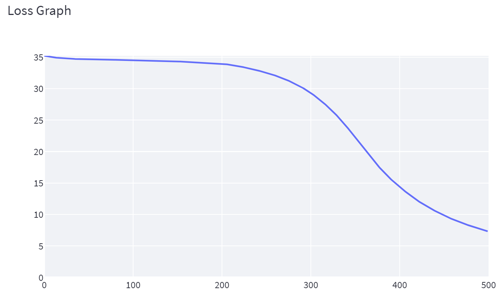
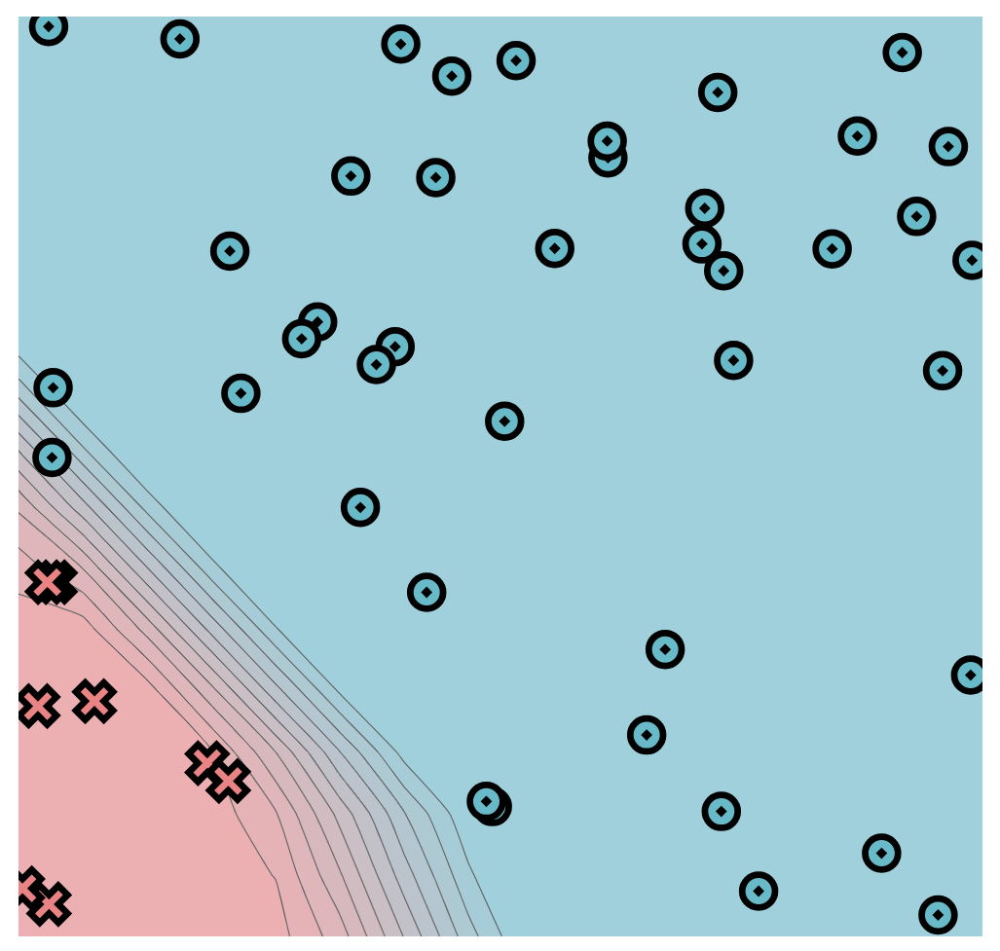
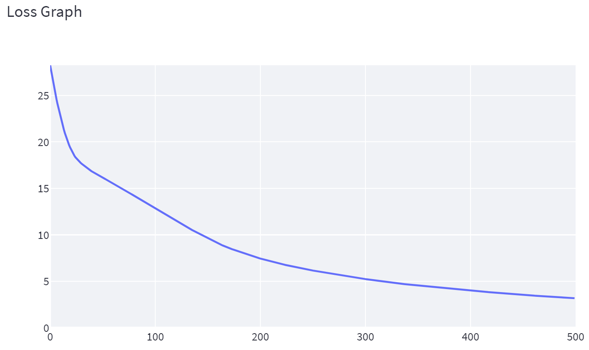
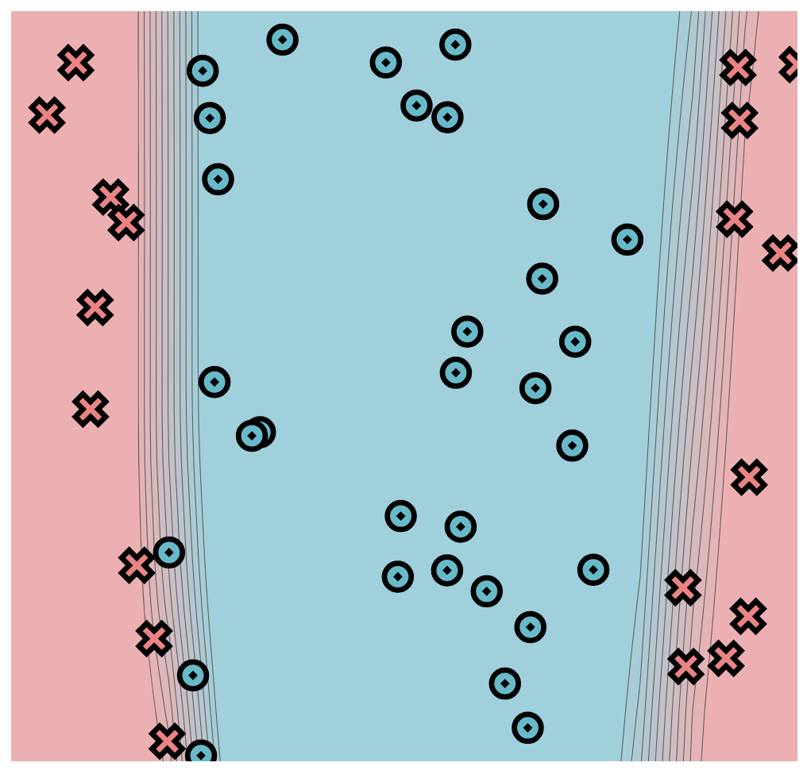
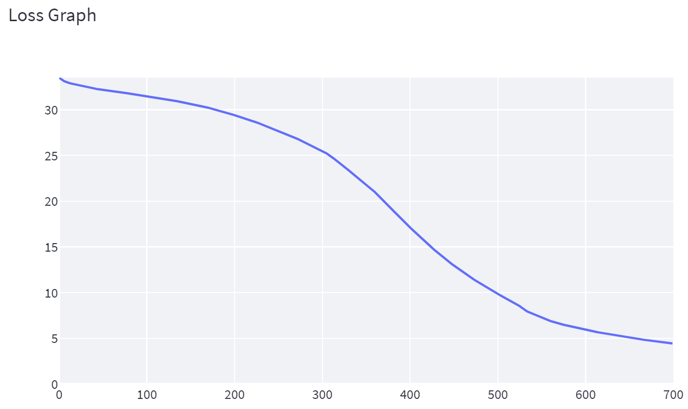
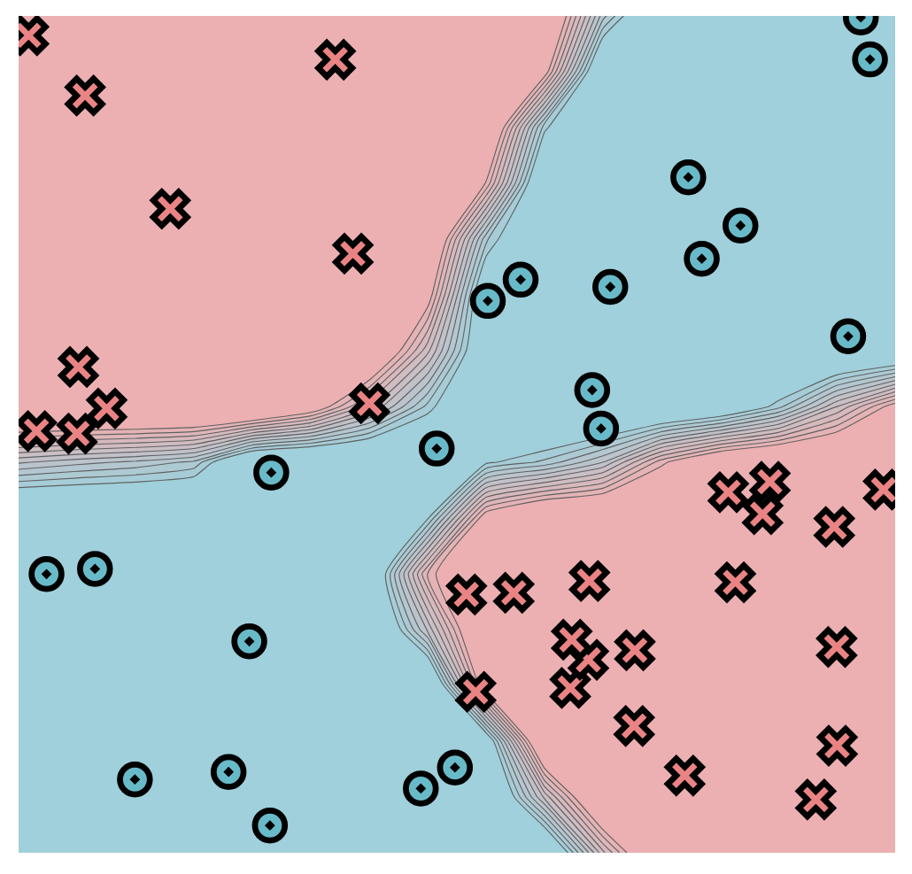
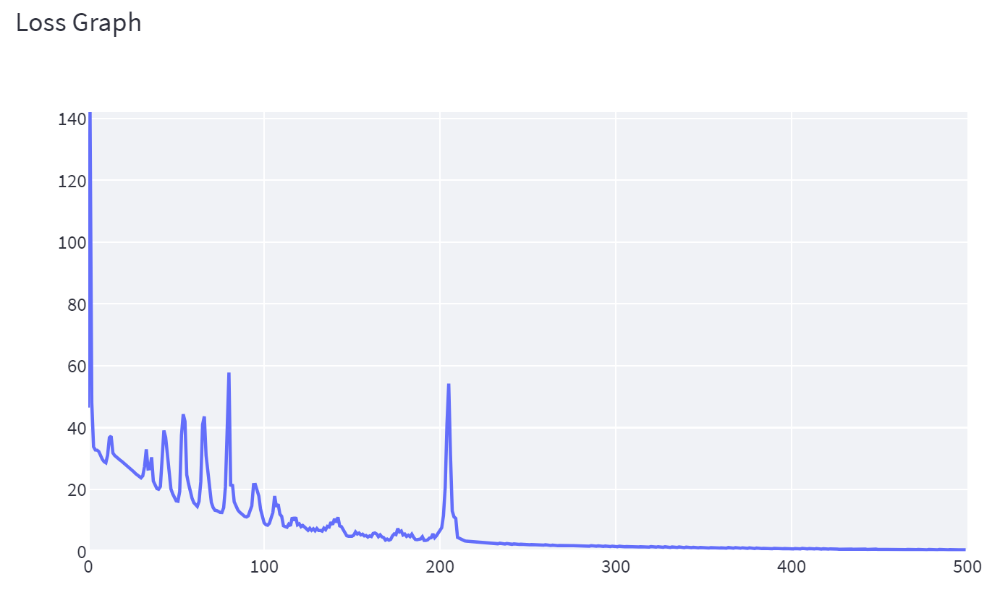

MiniTorch is a ground-up implementation of PyTorch, a popular deep learning framework used for building and training neural networks. The project was built from scratch as part of the Machine Learning Engineering course at Cornell Tech, taught by Professor Sasha Rush.

**minitorch-autodiff**: This module adds automatic differentiation by constructing a computation graph over scalar operations. It implements forward and backward passes using the chain rule, allowing gradients to be computed for any scalar expression. This enables training of small neural networks using scalar-based gradient descent.


# MiniTorch Module 1


* Docs: https://minitorch.github.io/

* Overview: https://minitorch.github.io/module1/module1/

This assignment requires the following files from the previous assignments. You can get these by running

```bash
python sync_previous_module.py previous-module-dir current-module-dir
```

The files that will be synced are:

        minitorch/operators.py minitorch/module.py tests/test_module.py tests/test_operators.py project/run_manual.py

---
# Task 1.5
## Simple
- size of hidden layer = 2
- Learning rate = 0.1
- epochs = 500



Epoch: 0/500, loss: 0, correct: 0\
Epoch: 10/500, loss: 35.00424676720213, correct: 24\
Epoch: 20/500, loss: 34.85175817099701, correct: 24\
Epoch: 30/500, loss: 34.75648308851704, correct: 24\
Epoch: 40/500, loss: 34.69564104822013, correct: 24\
Epoch: 50/500, loss: 34.65536052881252, correct: 24\
Epoch: 60/500, loss: 34.626983992822026, correct: 27\
Epoch: 70/500, loss: 34.604871654774186, correct: 26\
Epoch: 80/500, loss: 34.58520467002289, correct: 26\
Epoch: 90/500, loss: 34.56472499257369, correct: 26\
Epoch: 100/500, loss: 34.542679961231244, correct: 26\
Epoch: 110/500, loss: 34.51669087666892, correct: 26\
Epoch: 120/500, loss: 34.484970798785426, correct: 26\
Epoch: 130/500, loss: 34.440381329177306, correct: 27\
Epoch: 140/500, loss: 34.3872710487127, correct: 29\
Epoch: 150/500, loss: 34.32678725454507, correct: 30\
Epoch: 160/500, loss: 34.26092117549543, correct: 30\
Epoch: 170/500, loss: 34.20043435495133, correct: 30\
Epoch: 180/500, loss: 34.140412986189496, correct: 31\
Epoch: 190/500, loss: 34.07047647790304, correct: 33\
Epoch: 200/500, loss: 33.95455104509423, correct: 34\
Epoch: 210/500, loss: 33.79956582483078, correct: 34\
Epoch: 220/500, loss: 33.57684403309801, correct: 35\
Epoch: 230/500, loss: 33.263192277715106, correct: 36\
Epoch: 240/500, loss: 32.928773817898055, correct: 32\
Epoch: 250/500, loss: 32.562175049002775, correct: 32\
Epoch: 260/500, loss: 32.1299551679201, correct: 33\
Epoch: 270/500, loss: 31.616551948025105, correct: 34\
Epoch: 280/500, loss: 30.997404195972283, correct: 35\
Epoch: 290/500, loss: 30.273711217369918, correct: 36\
Epoch: 300/500, loss: 29.405832869745442, correct: 39\
Epoch: 310/500, loss: 28.3587139431095, correct: 41\
Epoch: 320/500, loss: 27.15183310686489, correct: 41\
Epoch: 330/500, loss: 25.762781700681526, correct: 42\
Epoch: 340/500, loss: 24.181425634086526, correct: 45\
Epoch: 350/500, loss: 22.403215750345556, correct: 46\
Epoch: 360/500, loss: 20.553881510758256, correct: 47\
Epoch: 370/500, loss: 18.801116034853838, correct: 48\
Epoch: 380/500, loss: 17.197348736558524, correct: 50\
Epoch: 390/500, loss: 15.746262845976641, correct: 50\
Epoch: 400/500, loss: 14.485785636147611, correct: 50\
Epoch: 410/500, loss: 13.35027867254029, correct: 50\
Epoch: 420/500, loss: 12.308552570358188, correct: 50\
Epoch: 430/500, loss: 11.420518545127745, correct: 50\
Epoch: 440/500, loss: 10.623537743026283, correct: 50\
Epoch: 450/500, loss: 9.904809926769774, correct: 50\
Epoch: 460/500, loss: 9.268421401752459, correct: 50\
Epoch: 470/500, loss: 8.711414704919372, correct: 50\
Epoch: 480/500, loss: 8.208349250751, correct: 50\
Epoch: 490/500, loss: 7.7497991379192195, correct: 50\
Epoch: 500/500, loss: 7.331519154197674, correct: 50

---
## Diag
- size of hidden layer = 2
- Learning rate = 0.1
- epochs = 500



Epoch: 0/500, loss: 0, correct: 0\
Epoch: 10/500, loss: 23.09386618016406, correct: 42\
Epoch: 20/500, loss: 19.392867337286305, correct: 42\
Epoch: 30/500, loss: 17.740796768561395, correct: 42\
Epoch: 40/500, loss: 16.87287117419896, correct: 42\
Epoch: 50/500, loss: 16.210756490176838, correct: 42\
Epoch: 60/500, loss: 15.581282575946506, correct: 42\
Epoch: 70/500, loss: 14.927556705394041, correct: 42\
Epoch: 80/500, loss: 14.26032822997004, correct: 42\
Epoch: 90/500, loss: 13.57348847450788, correct: 42\
Epoch: 100/500, loss: 12.863838084314905, correct: 42\
Epoch: 110/500, loss: 12.17834551346699, correct: 42\
Epoch: 120/500, loss: 11.511540212338415, correct: 42\
Epoch: 130/500, loss: 10.887728123916647, correct: 42\
Epoch: 140/500, loss: 10.281136264262038, correct: 42\
Epoch: 150/500, loss: 9.694235556570314, correct: 44\
Epoch: 160/500, loss: 9.13048267996341, correct: 44\
Epoch: 170/500, loss: 8.62549690232226, correct: 45\
Epoch: 180/500, loss: 8.214891264306836, correct: 46\
Epoch: 190/500, loss: 7.827279980359984, correct: 46\
Epoch: 200/500, loss: 7.4771928000841825, correct: 46\
Epoch: 210/500, loss: 7.172542125430421, correct: 47\
Epoch: 220/500, loss: 6.888143582399787, correct: 48\
Epoch: 230/500, loss: 6.625280157155573, correct: 49\
Epoch: 240/500, loss: 6.393302621940263, correct: 49\
Epoch: 250/500, loss: 6.176171270451005, correct: 50\
Epoch: 260/500, loss: 5.970949537720717, correct: 50\
Epoch: 270/500, loss: 5.7777768252919826, correct: 50\
Epoch: 280/500, loss: 5.592644475216172, correct: 50\
Epoch: 290/500, loss: 5.418677608007319, correct: 50\
Epoch: 300/500, loss: 5.251068436515995, correct: 50\
Epoch: 310/500, loss: 5.093107194459684, correct: 50\
Epoch: 320/500, loss: 4.94383680519991, correct: 50\
Epoch: 330/500, loss: 4.80014339485105, correct: 50\
Epoch: 340/500, loss: 4.671154635015126, correct: 50\
Epoch: 350/500, loss: 4.546767518655572, correct: 50\
Epoch: 360/500, loss: 4.425753029311357, correct: 50\
Epoch: 370/500, loss: 4.315569437465712, correct: 50\
Epoch: 380/500, loss: 4.204914180985619, correct: 50\
Epoch: 390/500, loss: 4.102040274529395, correct: 50\
Epoch: 400/500, loss: 4.005835502797524, correct: 50\
Epoch: 410/500, loss: 3.910632399137905, correct: 50\
Epoch: 420/500, loss: 3.8166272405988684, correct: 50\
Epoch: 430/500, loss: 3.7187956886534916, correct: 50\
Epoch: 440/500, loss: 3.629614409866097, correct: 50\
Epoch: 450/500, loss: 3.5469817459189317, correct: 50\
Epoch: 460/500, loss: 3.4677328782646493, correct: 50\
Epoch: 470/500, loss: 3.391218364441997, correct: 50\
Epoch: 480/500, loss: 3.3158685273310025, correct: 50\
Epoch: 490/500, loss: 3.245436604705319, correct: 50\
Epoch: 500/500, loss: 3.178653391251464, correct: 50

---
## Split
- size of hidden layer = 10
- Learning rate = 0.1
- epochs = 700



Epoch: 0/700, loss: 0, correct: 0\
Epoch: 10/700, loss: 32.974391145830985, correct: 31\
Epoch: 20/700, loss: 32.72759411449986, correct: 31\
Epoch: 30/700, loss: 32.51090973529766, correct: 31\
Epoch: 40/700, loss: 32.328586707720106, correct: 31\
Epoch: 50/700, loss: 32.17056041261407, correct: 31\
Epoch: 60/700, loss: 32.03680751540988, correct: 31\
Epoch: 70/700, loss: 31.904449089728274, correct: 31\
Epoch: 80/700, loss: 31.774823260548683, correct: 31\
Epoch: 90/700, loss: 31.63844611578376, correct: 31\
Epoch: 100/700, loss: 31.494188728004918, correct: 31\
Epoch: 110/700, loss: 31.34217574451808, correct: 31\
Epoch: 120/700, loss: 31.185372440641707, correct: 31\
Epoch: 130/700, loss: 31.018191704321353, correct: 31\
Epoch: 140/700, loss: 30.839687882934193, correct: 31\
Epoch: 150/700, loss: 30.649059385415168, correct: 31\
Epoch: 160/700, loss: 30.445205512594054, correct: 31\
Epoch: 170/700, loss: 30.227587070877558, correct: 31\
Epoch: 180/700, loss: 29.982938290420428, correct: 31\
Epoch: 190/700, loss: 29.706096347400656, correct: 31\
Epoch: 200/700, loss: 29.426725845515563, correct: 31\
Epoch: 210/700, loss: 29.129938873601922, correct: 31\
Epoch: 220/700, loss: 28.816639824614384, correct: 34\
Epoch: 230/700, loss: 28.4589440598862, correct: 34\
Epoch: 240/700, loss: 28.09811832505942, correct: 34\
Epoch: 250/700, loss: 27.726387617984503, correct: 35\
Epoch: 260/700, loss: 27.3332810311464, correct: 35\
Epoch: 270/700, loss: 26.918770266569812, correct: 38\
Epoch: 280/700, loss: 26.478970688959823, correct: 39\
Epoch: 290/700, loss: 26.011775237660945, correct: 40\
Epoch: 300/700, loss: 25.518609198517936, correct: 42\
Epoch: 310/700, loss: 24.93685865543591, correct: 42\
Epoch: 320/700, loss: 24.196831969935964, correct: 44\
Epoch: 330/700, loss: 23.434696399434117, correct: 44\
Epoch: 340/700, loss: 22.672803304537812, correct: 45\
Epoch: 350/700, loss: 21.891824716658686, correct: 46\
Epoch: 360/700, loss: 21.058287950021576, correct: 46\
Epoch: 370/700, loss: 20.12150594692143, correct: 47\
Epoch: 380/700, loss: 19.13807992122225, correct: 48\
Epoch: 390/700, loss: 18.133773505096386, correct: 48\
Epoch: 400/700, loss: 17.20208228978398, correct: 50\
Epoch: 410/700, loss: 16.287010339300167, correct: 50\
Epoch: 420/700, loss: 15.401036428340158, correct: 50\
Epoch: 430/700, loss: 14.555254870503267, correct: 50\
Epoch: 440/700, loss: 13.762841826855439, correct: 50\
Epoch: 450/700, loss: 13.01651953944879, correct: 50\
Epoch: 460/700, loss: 12.315785371666893, correct: 50\
Epoch: 470/700, loss: 11.659541698196689, correct: 50\
Epoch: 480/700, loss: 11.0403380659897, correct: 50\
Epoch: 490/700, loss: 10.459214298715175, correct: 50\
Epoch: 500/700, loss: 9.895841871610957, correct: 50\
Epoch: 510/700, loss: 9.386964118520137, correct: 50\
Epoch: 520/700, loss: 8.914928682383591, correct: 50\
Epoch: 530/700, loss: 8.198995361856152, correct: 50\
Epoch: 540/700, loss: 7.698588045603077, correct: 50\
Epoch: 550/700, loss: 7.33549361169203, correct: 50\
Epoch: 560/700, loss: 6.9244037884997, correct: 50\
Epoch: 570/700, loss: 6.632145074933034, correct: 50\
Epoch: 580/700, loss: 6.385425495965768, correct: 50\
Epoch: 590/700, loss: 6.158577495990569, correct: 50\
Epoch: 600/700, loss: 5.94785312956037, correct: 50\
Epoch: 610/700, loss: 5.752010399976897, correct: 50\
Epoch: 620/700, loss: 5.568878352591671, correct: 50\
Epoch: 630/700, loss: 5.397094069658929, correct: 50\
Epoch: 640/700, loss: 5.235741105296412, correct: 50\
Epoch: 650/700, loss: 5.083859625678079, correct: 50\
Epoch: 660/700, loss: 4.940596399882154, correct: 50\
Epoch: 670/700, loss: 4.805300348323385, correct: 50\
Epoch: 680/700, loss: 4.677634137854816, correct: 50\
Epoch: 690/700, loss: 4.556562196459561, correct: 50\
Epoch: 700/700, loss: 4.443710185176175, correct: 50

---
## Xor
- size of hidden layer = 15
- Learning rate = 1.0
- epochs = 500



Epoch: 0/500, loss: 0, correct: 0\
Epoch: 10/500, loss: 28.977305695619467, correct: 35\
Epoch: 20/500, loss: 29.11382583526589, correct: 29\
Epoch: 30/500, loss: 24.085372014498798, correct: 44\
Epoch: 40/500, loss: 20.302562421986615, correct: 44\
Epoch: 50/500, loss: 17.409894645791606, correct: 46\
Epoch: 60/500, loss: 17.16869157078322, correct: 46\
Epoch: 70/500, loss: 19.190158968524248, correct: 45\
Epoch: 80/500, loss: 41.1129751266961, correct: 30\
Epoch: 90/500, loss: 11.242970602422009, correct: 48\
Epoch: 100/500, loss: 10.359403181756667, correct: 47\
Epoch: 110/500, loss: 11.976707937992702, correct: 46\
Epoch: 120/500, loss: 8.525851989668253, correct: 47\
Epoch: 130/500, loss: 6.6252927796167915, correct: 47\
Epoch: 140/500, loss: 8.63399575383731, correct: 47\
Epoch: 150/500, loss: 4.696632490322322, correct: 48\
Epoch: 160/500, loss: 4.58835277977654, correct: 48\
Epoch: 170/500, loss: 3.613269985345187, correct: 49\
Epoch: 180/500, loss: 5.2425083845817255, correct: 48\
Epoch: 190/500, loss: 3.9922949788786597, correct: 49\
Epoch: 200/500, loss: 5.786148339874191, correct: 48\
Epoch: 210/500, loss: 10.629029402969278, correct: 47\
Epoch: 220/500, loss: 2.9813196152391295, correct: 49\
Epoch: 230/500, loss: 2.5734835685999466, correct: 49\
Epoch: 240/500, loss: 2.3211230218415166, correct: 49\
Epoch: 250/500, loss: 2.1568694041169567, correct: 50\
Epoch: 260/500, loss: 1.988089867576652, correct: 49\
Epoch: 270/500, loss: 1.831326550809766, correct: 50\
Epoch: 280/500, loss: 1.7326551929813934, correct: 50\
Epoch: 290/500, loss: 1.6225140818357089, correct: 50\
Epoch: 300/500, loss: 1.5072602984225454, correct: 50\
Epoch: 310/500, loss: 1.4250748248338603, correct: 50\
Epoch: 320/500, loss: 1.3662671818406964, correct: 50\
Epoch: 330/500, loss: 1.2715903997725788, correct: 50\
Epoch: 340/500, loss: 1.1824701232589516, correct: 50\
Epoch: 350/500, loss: 1.0969916064421361, correct: 50\
Epoch: 360/500, loss: 1.0351903571026915, correct: 50\
Epoch: 370/500, loss: 0.9931901749117402, correct: 50\
Epoch: 380/500, loss: 0.9073097210721032, correct: 50\
Epoch: 390/500, loss: 0.8401008789807106, correct: 50\
Epoch: 400/500, loss: 0.7910766603200251, correct: 50\
Epoch: 410/500, loss: 0.7630838231159454, correct: 50\
Epoch: 420/500, loss: 0.6944173402171095, correct: 50\
Epoch: 430/500, loss: 0.6507603826114463, correct: 50\
Epoch: 440/500, loss: 0.6160206056483183, correct: 50\
Epoch: 450/500, loss: 0.5794597583702039, correct: 50\
Epoch: 460/500, loss: 0.5500188008450795, correct: 50\
Epoch: 470/500, loss: 0.5160289801730442, correct: 50\
Epoch: 480/500, loss: 0.48856450176672567, correct: 50\
Epoch: 490/500, loss: 0.4668380423904816, correct: 50\
Epoch: 500/500, loss: 0.4419010278147746, correct: 50
